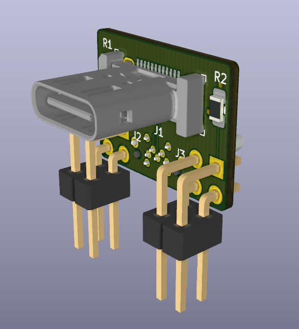
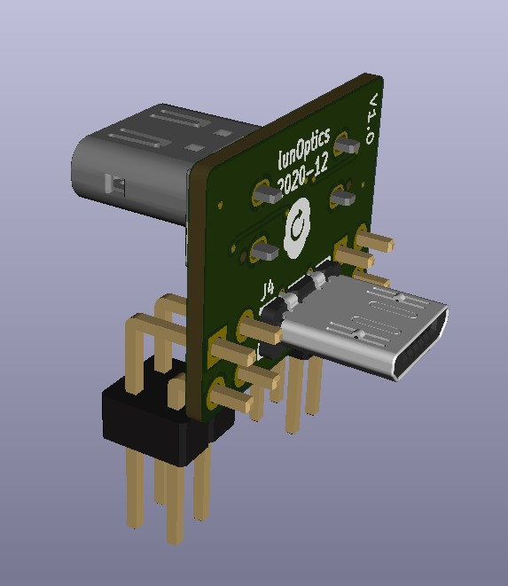
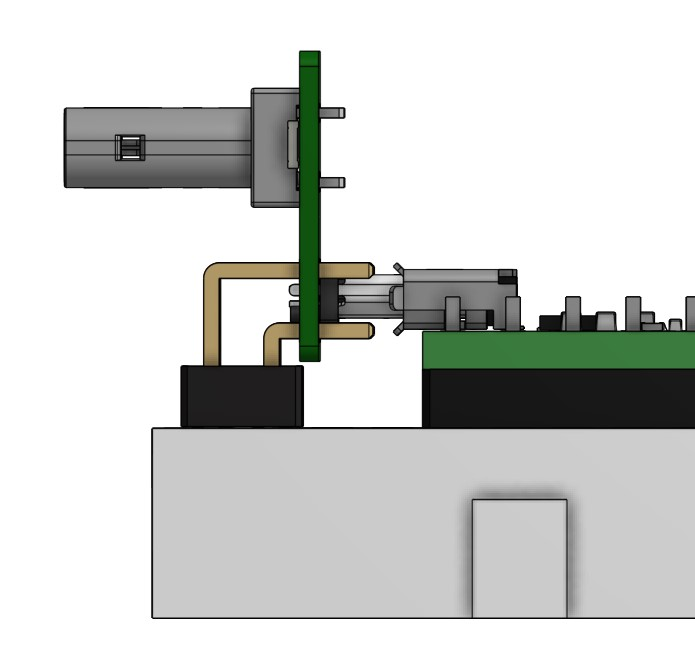
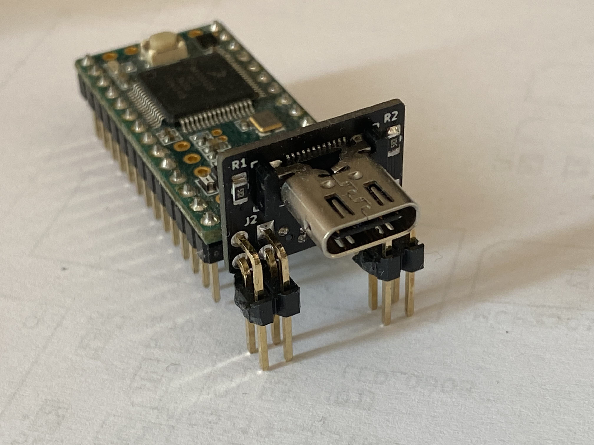
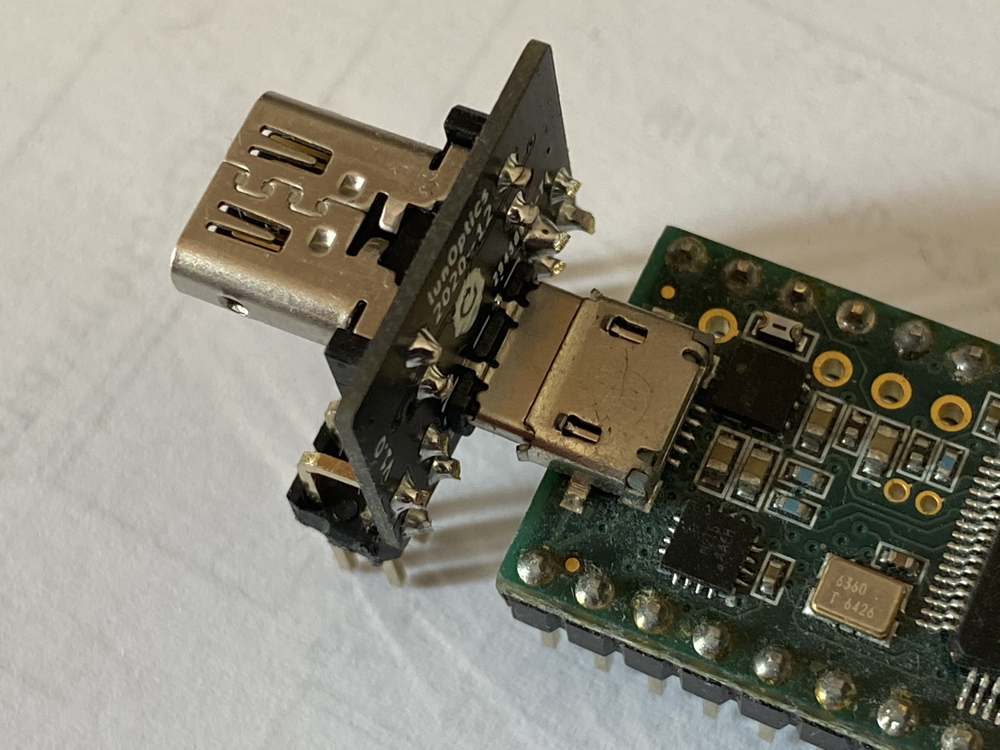
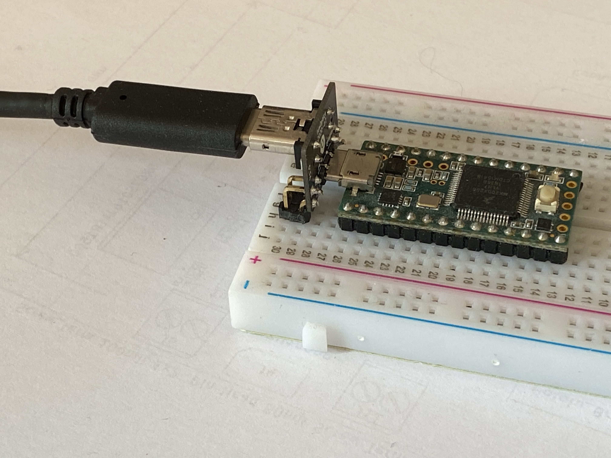

See also https://forum.pjrc.com/threads/65654-USB-C-Adapter

# USB-C_Adapter
Breadboard friendly USB-C to USB-MicroB adapter

BOM: https://octopart.com/bom-tool/3KlzNDGG

Solder pin header AFTER plugging the adapter & board in a breadboard. Aligning distances to account for tolerances before soldering pin header.
